# Designer Task 2.0 (На русском)

**Описание приложения**

G10 - умный трекер калорий, помощник в питании для людей, которые преследуют цели - похудение, набор массы, и улучшение общего состояния здоровья через отслеживание питания/сна/тренировок. 

Отличие от конкурентов:

1. Самый быстрый **AI-сканер продуктов (по количеству кликов)**
2. Умная система, которая **еженедельно подстраивается под тебя** и помогает достигать цели
3. **Отслеживание калорий, нутриентов и витаминов**
4. **Самая большая база продуктов** в Европе и СНГ (своя база данных)
5. **Планирование приёмов пищи** и контроль рациона (спланировать, чем заполнить 300кл вечером, или заранее прописать продукты по дням)
6. **Персональные отчёты и аналитика (**мы собираем данные по питанию, тренировкам (интеграция Apple Watch, Garmin, FitBit, Whoop) и сну. На основании этих данных - прогнозы, паттерны, как улучшить состояние. 
7. **AI-помощник**, который анализирует питание и тренировки, помогая улучшать результаты
8. **Виджеты** с ключевыми показателями
9. **Отслеживание прогресса веса** и динамики изменений
10. Определение, когда человек может “сорваться” - на основании данных и AI анализа, чтобы помочь продолжить человеку в достижении целей. 

**Цель/Контекст**

Мы сделали бета-тестирование на 160 человек, пользовались приложением сами - на данном этапе понятно, что пользователям важно, что удобно. 

Дизайн должен быть простым, в первую очередь все данные должны читать просто, приложение должно быть интуитивно понятным, как это достигнуто - дизайн должен быть премиальным продуктом для пользователей. Должен вызывать доверие. 

**Принципы**

1. Простота использования для пользователя
2. Премиальность продукта
3. Не должно быть слишком ярким, цвета должны быть умеренные
4. Шрифты должны подчеркивать премиальность продукта, но не должны слишком выделяться (возможно только для заголовков)

**Ожидания**

1. Figma File с структурированной дизайн системой.
    - Пример в тестовом задании
        
        Нужно, чтобы шрифты были заданы дизайн системой, и их было не много. Тоже самое про цвета. Все цвета должны проходить контраст проверку 6-7:1; Кнопки тоже, должно быть определенное количество основных кнопок, чтобы их можно было переиспользовать, чтобы дизайн был консистентным. 
        

            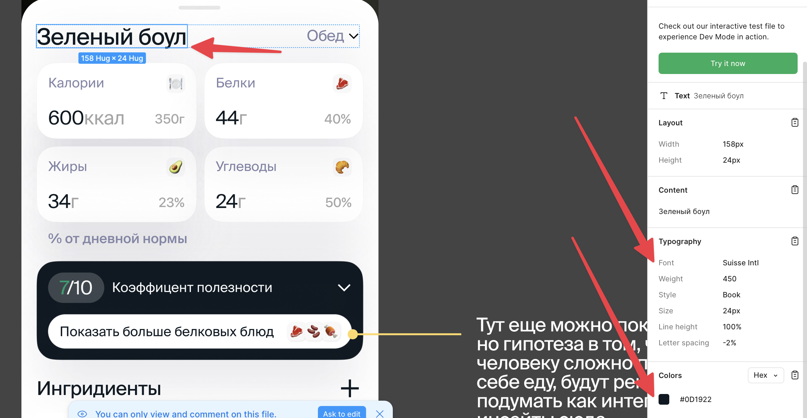
        

        
2. Анимированные иконки, микро-анимации. Иконки анимации должны быть предоставлены. Более сложные анимации можно примером из другого приложения или не pixel- perfect
3. Переходы между экранами (bottom sheet, fullscreen, push, etc)
4. Регулярные апдейты по дизайн файлу, чтобы ускорить фидбек луп (фидбек во время, когда ты не работаешь над документом) 

**Скоуп Работ**

# **Онбодинг**

В большинстве экраны повторяются, я их прописал, чтобы правильные иконки подобрать к элементам. На онбординге хотим собрать, как можно больше информации о пользователе без его утомления для маркетинга и конвертации пользователя в платного. Порядок экранов не финализирован. 

1. Первый экран, который видит пользователь
    

        
    Первый экран, который увидит пользователь должен вызвать эмоцию, четко дать понять, что пользователь ожидает от приложения, как оно может ему помочь; С экрана пользователь перейдет сразу на онбординг (не логин). Гипотеза в том, что если пользователь захочет сразу залогиниться, и что-то пойдет не так - закроет приложение. А если пройдет весь онбординг - потратит время, плюс увидит преимущества приложения. 
        
    Некоторые идея, как можно сделать главный экран
    

    <video width="320" height="240" controls>
        <source src="content/g10app_start_example.mp4" type="video/mp4">
    </video>
   

    

    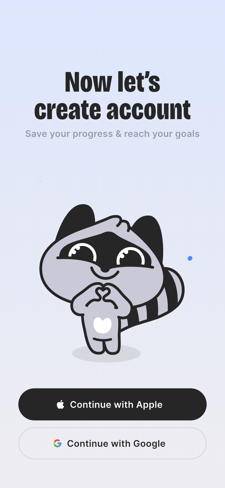
    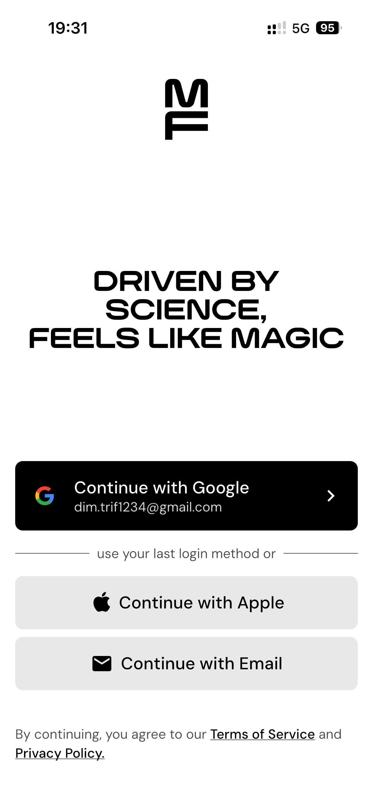
    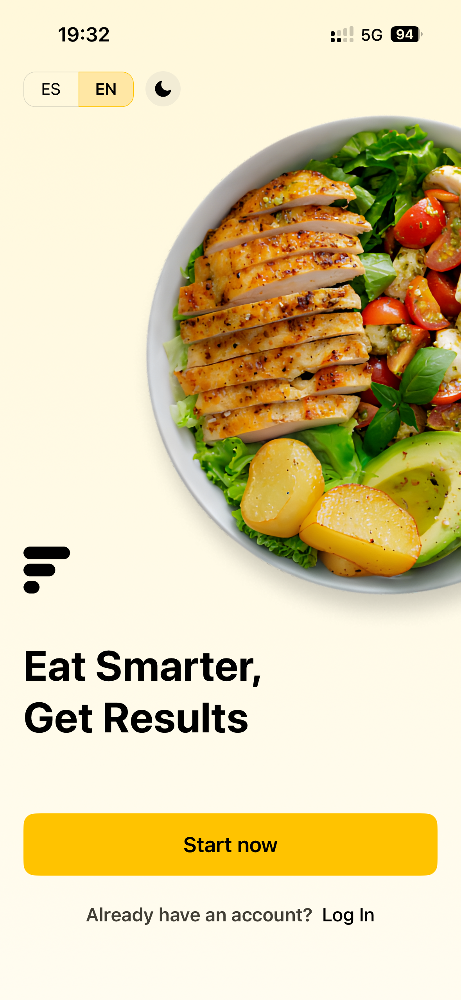
    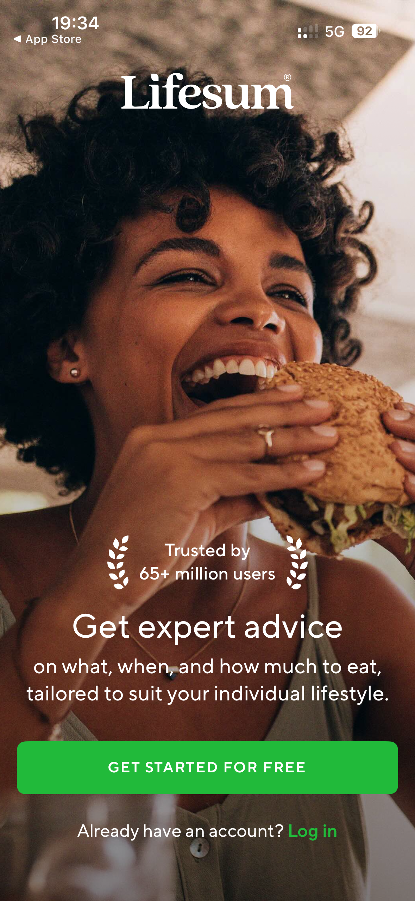
    

    
    ---

    Мой любимый из этих - Fitia (1) и MacroFactor (2) из-за простоты. 
        4 и 5 слишком много элементов на мой взгляд. 
    
2. Экран онбординга, который подчеркивает преимущества
    

3. Экран онбординга, как вы узнали о нас
    

        
    Экран необходим, чтобы понимать, откуда приходит пользователь в приложение. 
    Ставлю его в начало, так как даже если пользователь отвалится в прохождении онбординга - сможем лучше понять, какие каналы привлекают людей.
        
4. Экран с выбором пола
    

        
    Я бы предпочел экран выбора пола, возраста, роста и веса совместить в один, как в Fitia; 
        
    

        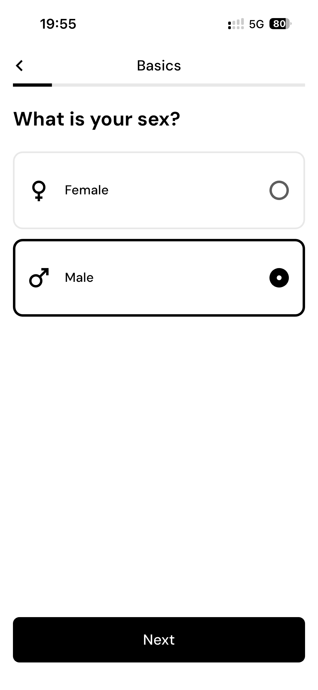
        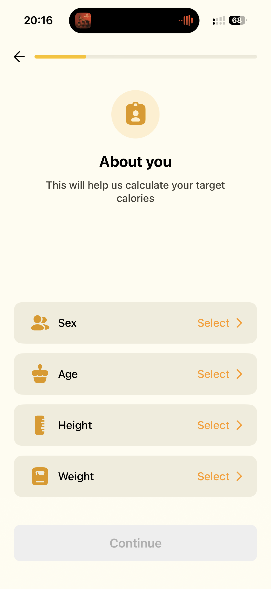
    

        
5. Экран с выбором текущего веса
    

        
        
    

        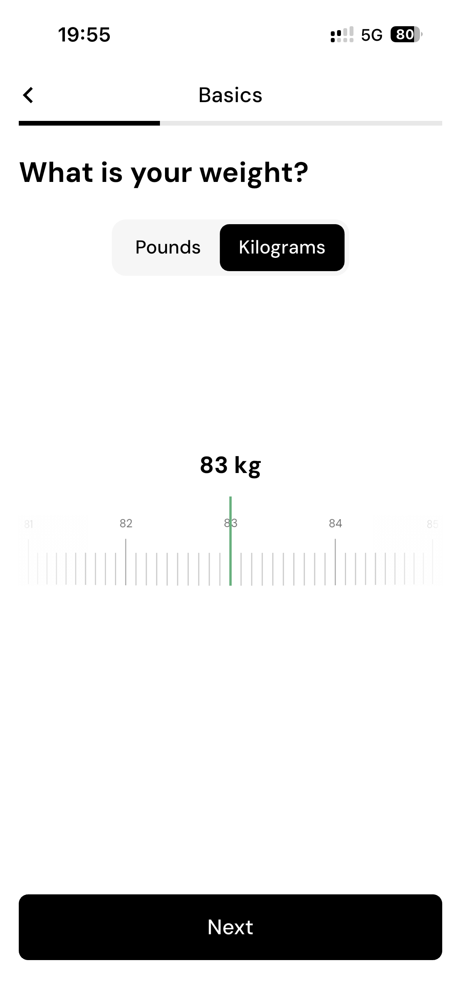
    

        
6. Экран с выбором даты рождения
    

        
    

        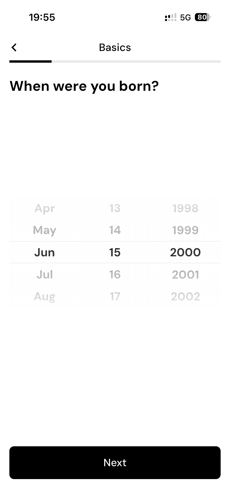
    

        
7. Экран с выбором роста
    

        
    

        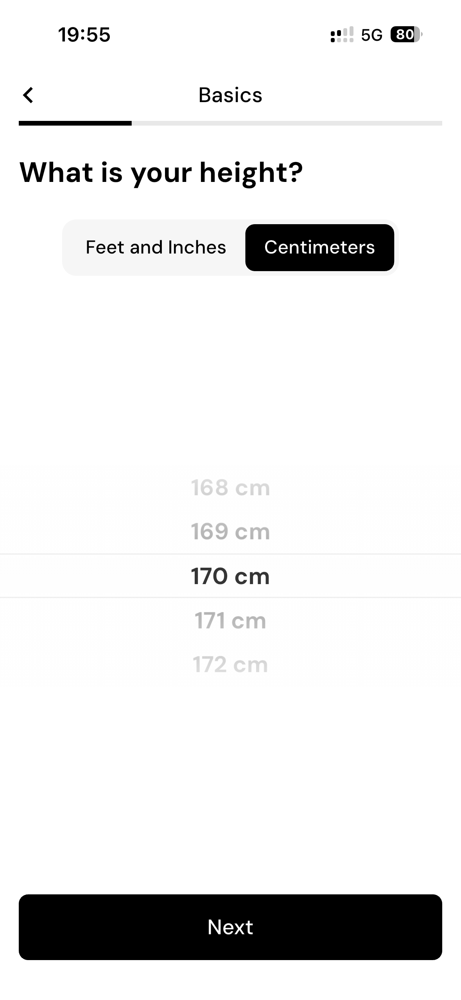
    

        
8. Экран с выбором текущего процента жира %
    

        
    Для мужчин - мужские картинки, для женщин - женские. 
        
    

        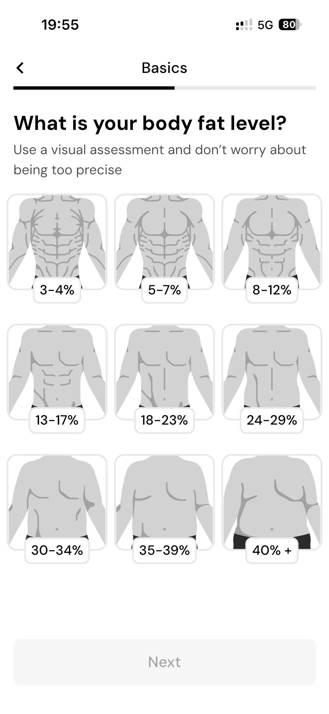
    

        
9. Экран онбординга с выбором цели по весу
    

        
    Цели нескольких типов - сбросить вес, набрать и поддерживать,
        
    

        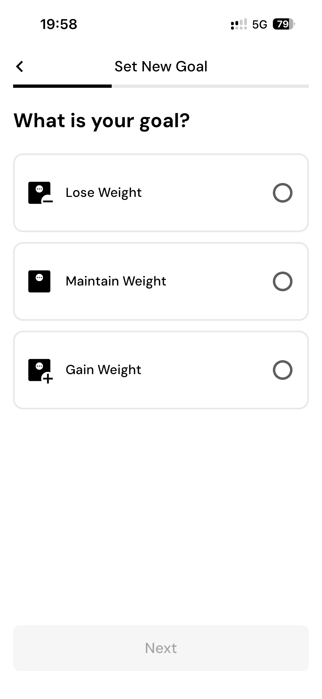
    

        
10. Экран с выбором веса, к которому ты стремишься
    

        
    На этом экране пользователь выбирает целевой вес (если он хочет похудеть или набрать массу). Показываем ему текущую и целевую цифру. Если введённый вес выходит за пределы здоровой нормы (слишком низкий или высокий для его параметров) — показываем предупреждение, что такая цель может быть небезопасной, и блокируем кнопку «Продолжить». Приложенный скриншот — хороший пример с ползунком, но интерфейс можно упростить. 
        
    

        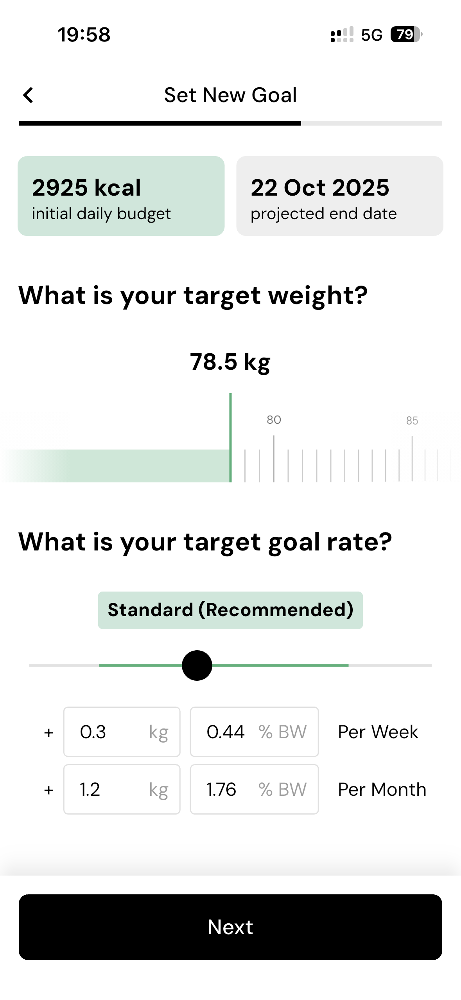
    

        
11. Экран онбординга Social Proof
    

    Экран показывает персонализированные преимущества приложения на основе данных пользователя. Демонстрируем статистику успеха (например: «90% пользователей с похожими параметрами достигли цели») и социальное доказательство — фотографии трансформаций «до/после» от реальных пользователей.
    Плюс это перерыв от бесконечных вопросов для пользователя
        
    

        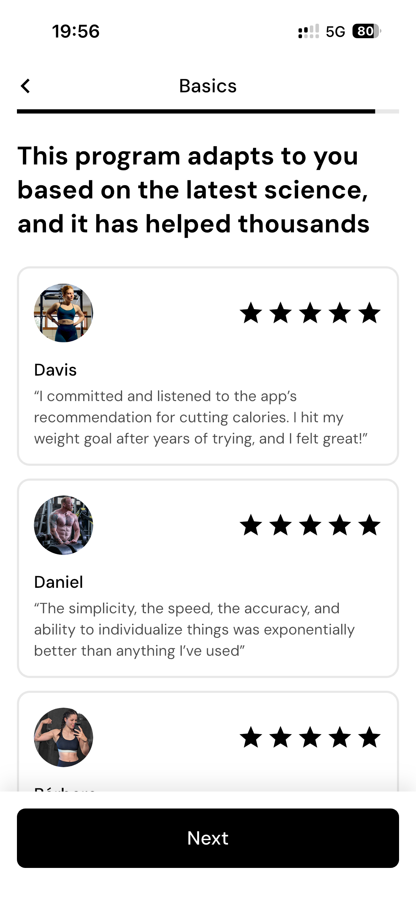
    

    

12. Экран синхронизации с Apple Health
    

        
    

        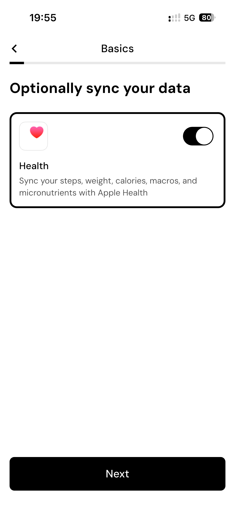
    

13. Экран с выбором активности
    

        
    Активность пользователя
        
    - Сидячий образ жизни — минимальная физическая активность, работа за компьютером
    - Умеренно активный — лёгкие упражнения 1-3 раза в неделю
    - Активный — тренировки 3-5 раз в неделю
    - Очень активный — интенсивные тренировки 6-7 раз в неделю или физическая работа
        
    

        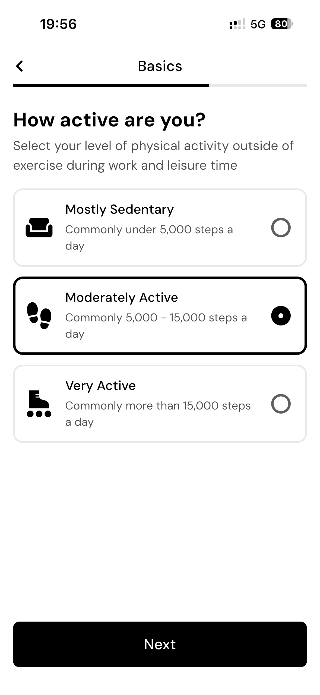
    

        
14. Экран с выбором скорости, как быстро ты хочешь достичь своего веса
    

        
    Обычно можно сжигать около 0.5-1кг веса за неделю, соответственно нужен выбор из этого промежутка, в зависимости от этого показываем финальную дату. При этом этот промежуток должен быть только в здоровых рамках, нельзя ввести 5кг в неделю
        
15. Экран с выбором типа диеты
    

        
    На этом экране пользователь выбирает тип диеты, которой он придерживается. Варианты: обычная, вегетарианская, пескетарианская, веганская, кето.
        
16. Экран с выбором потребления белка
    

        
    Экран нужен, чтобы скорректировать питание для пользователей, которые ходят в зал
        
    Хочешь, чтобы в твоём рационе было больше белка?
        
    Это помогает сохранять мышцы и дольше чувствовать сытость.
        
    [Да, я тренируюсь] [Нет, обычное питание]
        
17. Экран онбординга с запросом рейтинга
    

        
    Этот экран нужен, так как большинство пользователей не сконвертируется в платящих пользователей, а как показывает практика, если у человека классный опыт в приложении - он даст хорошую оценку даже не пользуясь
        
18. Экран онбординга с напоминанями

        
19. Экран онбордига с “составлением персонализированной программы”
    

    

        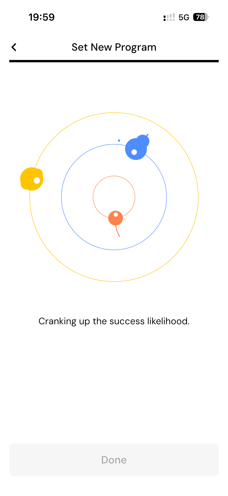
    

        
20. Paywall + Extra Paywall
    

        
    Перед Paywall необходимо показать пользователю преимущества приложения:
        
    1. Самый быстрый **AI-сканер продуктов**
    2. Умная система, которая **еженедельно подстраивается под тебя** и помогает достигать цели
    3. **Отслеживание калорий, нутриентов и витаминов**
    4. **Самая большая база продуктов** в Европе и СНГ
    5. **Планирование приёмов пищи** и контроль рациона
    6. **Персональные отчёты и аналитика**
    7. **AI-помощник**, который анализирует питание и тренировки, помогая улучшать результаты
    8. **Виджеты** с ключевыми показателями
    9. **Отслеживание прогресса веса** и динамики изменений
        
    

        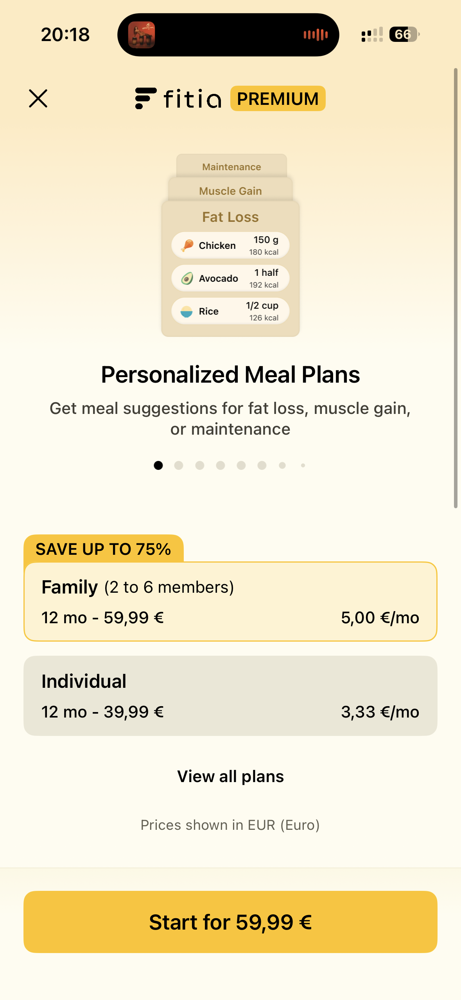
        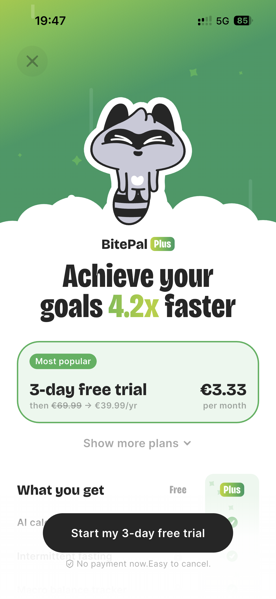
    

21. Экран авторизации в приложение
    

        
    Для России через гугл, яндекс, apple, почта и пароль

# **Главный экран**

   **TLDR:** 

Основные виджеты:
- Показ текущей даты, возможность перейти в другой день (календарик сверху)
- Показываем текущее питание за день (калорий, белки, жиры, углеводы)
- Показываем так же клетчатку, сахар, соль, витамины и минералы
- Показываем приемы пищи (завтрак, обед, ужин, перекус). Секции скрываются/показываются
- Показываем отслеживание воды
- Показываем отслеживание активности
- Показываем отслеживание веса (как в Yazio)
- Показываем заметки на день (опросник из 5 вопросов, на основании которых генерируется заметка на день и после будет анализироваться нами)

После экспериментов с главным экраном, на мой взгляд я нашел одно из лучших решений с точки зрения простоты, функциональности и данных. Критерии:
            
1. Простота (быстро понять, сколько осталось съесть, сколько съел), при этом не только в общем, но и для конкретного приема пищи (завтрак, обед, и т.д.)
2. Планирование приемов пищи часто люди на диете едят одно и тоже. Они заранее отмерили на весах и повторяют приемы пищи. С планированием можно скопировать завтрак или обед на конкретные дни, и отмечать, как “done” когда прием завершился. При этом ты заранее видишь, сколько у тебя получается на завтрак, обед и так далее. Это помогает заранее составлять день питания. (Это может быть сделано так же с AI)
            
Что улучшить?
            
- Шрифты, консистенность
- Секция с sugar, fiber, sodium, etc.
            
**Видео работы главного экрана**

    <video width="320" height="240" controls>
        <source src="content/g10app_home_and_planning.MP4" type="video/mp4">
    </video>

            
### Пример CalZ

**Что нравится:**
1. Геймификация на главном и подсказки, при добавлении блюда показывает, что AI может проанализировать твое питание не навязчиво

    

2. При добавлении показывает стрик и наградой в конце недели

    

### Пример Fitia

**Что нравится:**
1. Геймификация на главном и подсказки. При логирование увеличивает стрик с анимацией

    <video width="320" height="240" controls>
        <source src="content/fitia_streak_and_planning.MP4" type="video/mp4">
    </video>

--- 
# **Экран добавления питания**

   **TLDR**

   Максимально простой и быстрый способ добавления питания в приложении.
   Основные варианты:
   - Экран добавления с камерой (с камерой можно сразу делать до 10 фотографий, например, миска с черникой, тост с яйцом, кофе, одна печенька. После этого можно сразу подтвернить и закрыть экран или даже приложение. Не нужно дожидаться, пока придет ответ от AI. Ответ сразу уйдет в базу данных и будет доступен после, пока это обрабатывается в фоне, показываем заглушки. )
   - Экран добавления с поиском продукта
   - Экран добавления с сканированием по баркоду
   - Экран добавления с поиском (показ результатов поиска)
   - Экран добавления своего продукта
   - Экран с добавлением избранного
   - Экран добавления - Корзина

   [Видео работы логирования питания от MacroFactor](https://youtu.be/mYJkKGd3Xbk?t=152)

   

   **Пример - FatSecret, что нравится:**

   1. Если нажимаешь + на ужин - открывается экран с подсказками для ужина, то что часто ешь на ужин. Так же показывается другие продукты, которые часто ешь на завтрак, обед или перекус ниже. 
   

      <!-- Видео демонстрации работы подсказок для ужина -->
      <video width="320" height="240" controls>
        <source src="content/fat_secret_adding_example.MP4" type="video/mp4">
      </video>
   

   
   2. На главном экране видно, сколько ты съел на завтрак, обед и так далее. Так же видно, что именно и можно изменить сразу с главной. Так же есть кнопка "Copy", чтобы скопировать на другой день тот же самый прием пищи. 
   3. При добавлении продуктов, автоматически раскрывается секция с ужином, например, и она показана полностью (к ней скролится)

   Что не нравится:
   1. Дизайн выглядит устаревшим
   2. При добавлении продуктов не видно на сколько калорий ты уже добавил, это может быть полезно при планировании рациона. Нужно выйти в главное меню, чтобы посмотреть общую калорийность. 

   ### Пример - Fitia
   
   **Что нравится:**
   1. На главном экране можно отметить, что ты съел, а что в планировании. БЖУ и калории вычетаются из общего рациона, но ты можешь отметить, как только ты съел это. 
   

    <video width="320" height="240" controls>
        <source src="content/fitia_streak_and_planning.MP4" type="video/mp4">
    </video>
    

   2. Есть возможность скопировать прием пищи на другой день, и повторять этот прием пищи.
   

    <video width="320" height="240" controls>
        <source src="content/fitia_copy_food.MP4" type="video/mp4">
    </video>
    <video width="320" height="240" controls>
        <source src="content/fitia_copy_meals.MP4" type="video/mp4">
    </video>
    

   3. Можно удалить, как целый прием пищи, так и отдельный продукт из него. 
   

    <video width="320" height="240" controls>
        <source src="content/fitia_removing_meals.MP4" type="video/mp4">
    </video>
    

   4.Удобно перемещаться между логированием с поиском и камерой. 

   5.Просто отображаются ингредиенты продукта. 
   

    <video width="320" height="240" controls>
        <source src="content/fitia_ai_details_ingredients.MP4" type="video/mp4">
    </video>
   

   6. Показываются рецепты на конкретный рацион, например, для завтрака можно выбрать, что подходит под твои калории и цели. 
   7. Можно создать свой продукт (хотя сам UI кажется громостким)
   

    <video width="320" height="240" controls>
        <source src="content/fitia_custom_food.MP4" type="video/mp4">
    </video>
   

   8. Можно залогировать голосом и покажет, что ты наговорил. Может быть удобно, когда забыл сфоткать и лень вручную добавлять. 
   

    <video width="320" height="240" controls>
        <source src="content/fitia_mic.MP4" type="video/mp4">
    </video>
   

   **Что не нравится:**
   1. Если ты добавляешь сразу нескоько продуктов, можно забыть, что добавил, а что еще нет, можно добавлять много порций одного и того же продукта. В нашем случае, мы можем добавить только 1 раз (если нужно 2 порции одного и того же нужно изменить сам размер порции)
   2. При сканировании AI нужно ждать пока пройдет скан, нельзя сканировать другой продукт; Особенно плохо в ресторанах с слабым интернет покрытием, или где вообще нету интернета. То есть фактически это становится неиспользуемым. 

   ### Пример - CalZ
   
   **Что нравится:**
   1. Чистый и простой UI в плане добавления (прикольно создавать свой продукт, очень просто и очевидно) и просмотра ингредиентов
   

    <video width="320" height="240" controls>
        <source src="content/calz_details.MP4" type="video/mp4">
    </video>
   

   
   2. Подсказки в чате
   

    <video width="320" height="240" controls>
        <source src="content/calz_chat.MP4" type="video/mp4">
    </video>
   

   **Что не нравится**
   1. Мало функциональный (слишком простой, для долгосрочного планирования не подходит, так как каждый день нужно вручную вводить одинаковые блюда)

   ### Пример - Macrofactor

   **Что нравится:**
   1. Самый быстрый сканер на рынке (по их замерам). Можно быстро перемещаться между добавлением из списка, AI сканером, баркодом, добавлением в ручную. Все добавляется в корзину, где можно увидеть сколько калорий, БЖУ в твоем приеме пищи. 
   

    <video width="320" height="240" controls>
        <source src="content/macro_factor_adding_flow.MP4" type="video/mp4">
    </video>
   

   2. Можно создать свой прием пищи из готового (например, чтобы изменить количество БЖУ для курицы. Но опять же, то как сделано у них не user-friendly)
   

    <video width="320" height="240" controls>
        <source src="content/macro_factor_custom_food.MP4" type="video/mp4">
    </video>
   

   **Что не нравится:**
   1. При логировании не опытный пользователь теряется, слишком много информации (время приема пищи, сколько калорий, различный выбор, поиск, корзина), для каждого прима пищи показываются странные не читаемый порции (вместо простого 100г, куча информации 1 portion(25g), 1 medium, сложно вычленить просто информацию по граммам и калориям, так как нету структуры)
   2. Сканер блокирует продолжение флоу (нельзя сделать сразу несколько фоток, нужно ждать пока текущее закончится)
   3. Нету картинок у блюд. Это проблема, так как когда хочешь добавить что-то, не до конца уверен, правильное ли это блюдо, или нет. Картинка помогает понять. 

   ### Пример - Yazio
   **Что нравится:**
   1. User-Friednly интерфейс, разберется даже не опытный пользователь. 
   

    <video width="320" height="240" controls>
        <source src="content/yazio_adding_food.MP4" type="video/mp4">
    </video>
   

   2. При добавлении - блюдо сразу добаляется в завтрак, не нужно подвержать - это удобно, но при этом можно посмотреть корзину и удалить/изменить при необходимости. 
   3. Классно показано почему продукт полезен (теги), плюс удобно, что показано сразу предопределенные порции (у нас тоже в базе есть такое, например, по умолчанию яблоко 100г, но среднее яблоко 140г, нужно, чтобы было удобно переключаться между этим. Я это вижу как подсказки над клавиатурой)
   

    <video width="320" height="240" controls>
        <source src="content/yazio_adding_details.MP4" type="video/mp4">
    </video>
   

   4. Можно добавить в избранное
   5. Можно переключаться между избранным и частым быстро и удобно.
   6. Есть классное Summary твоего приема пищи. 
   

    
   

   **Что не нравится:**
   1. Не видно сколько калорий и БЖУ в корзине, нужно гадать-считать самому. 
   2. Можно добавлять много раз одно и тоже
   3. Нету картинок блюд, которые ты добавляешь. 
   4. Нету добавления голосом

   ### Пример - наше приложение G10

   **Что нравится:**
   1. Есть картинки, можно добавлять один раз
   

    <video width="320" height="240" controls>
        <source src="content/g10app_search.MP4" type="video/mp4">
    </video>
   

   2. Есть корзина (сейчас только показывает калории)
   3. Картинка показывается как профиль в телеграме (занимает меньше места для полезного контента, но всегда можно сделать больше)
   

    <video width="320" height="240" controls>
        <source src="content/g10app_ai_details.MP4" type="video/mp4">
    </video>
   

   
   **Что не нравится:**
   1. UI выглядит не огранизованным, кнопка "Сохранить" не особо видна, корзина не очевидна. Есть идея, как сделать корзину интернеснее, сейчас она живет сама по себе, нужно нажать на нее, чтобы увидеть, хотелось бы, чтобы свайпом вниз можно было увидеть сразу бжу, калории, и свайпом вверх убрать (как истории в телеграмме)
   2. Нету выбора предопределенной порции при редактировании. 
   3. Без нажатия "Сохранить" ничего не сохранится, можно забыть, упустить и потерять прогресс

# Аналитика

1. Виджет с графиками по весу
    

    Показываем график по весу, так же есть возможность выбрать период (неделя, месяц, полгода, год)
    Можно добавить логирование веса
    

        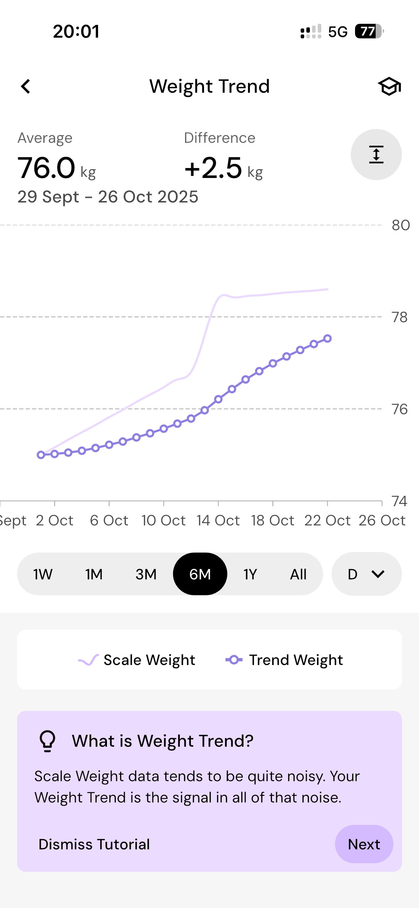
        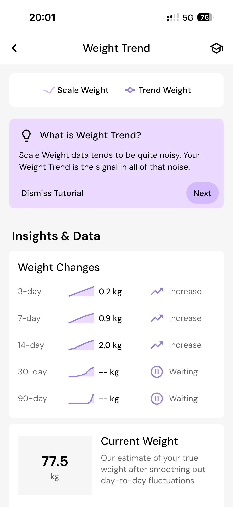
    

        
2. Виджет с состоянием здоровья сердца
    

    Показываем карточку с биением сердца (particles animation), 
    

3. Виджет с калориями за неделю

# Экран чата с AI G10

    В чате с AI G10 можно задавать вопросы по питанию, тренировкам, здоровью и т.д и получать ответы от AI. Копия ChatGPT интерфейса в чате (один чат, история видна в самом чате. Можно удалить историю чата.)

# Профиль и настройки

1. Экран настроек
2. Экран написать поддержке
3. Экран профиля пользователя
    

        
    

        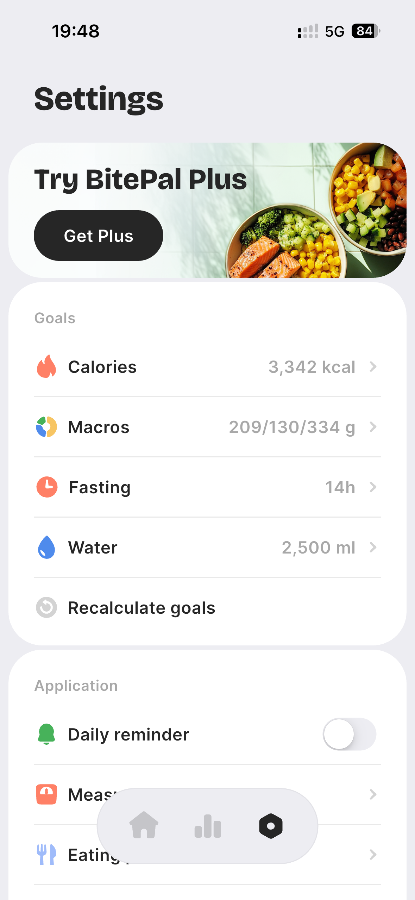
    

    

# Онбординг для фичей

1. Несколько мини подсказок для корзины и главной. 

# Иконка приложения и AppStore скриншоты

1. Скриншоты в App Store
2. Иконка приложения

**Success:**

1. Опыт использования чувствуется консистенным и “премиальным” на всех экранах
2. Консистетные шрифты, отступы, цвета, элементы
3. Пользователи могут описать при взгляде как чисто, красиво
4. Все экраны реализованы, в экранах проработаны краевые случаи
5. Создать переиспользуемую систему, чтобы все будущие экраны можно было строить на её основе.
    1. Все цвета, шрифты, радиусы, тени заданы токенами.
    2. Названия и структура компонентов понятны (Button/Primary, Text/H1 и т.п.).
    3. Визуальный гайд по spacing (например, 4pt или 8pt grid).

**Таймлайн:**

1. Начало работ: 10 ноября 2025*
2. Первая итерация: 17 ноября 2025
3. Последняя итерация до доработок: 8 декабря
4. Финальный дизайн: 8 декабря

* По договоренности я изменю это
